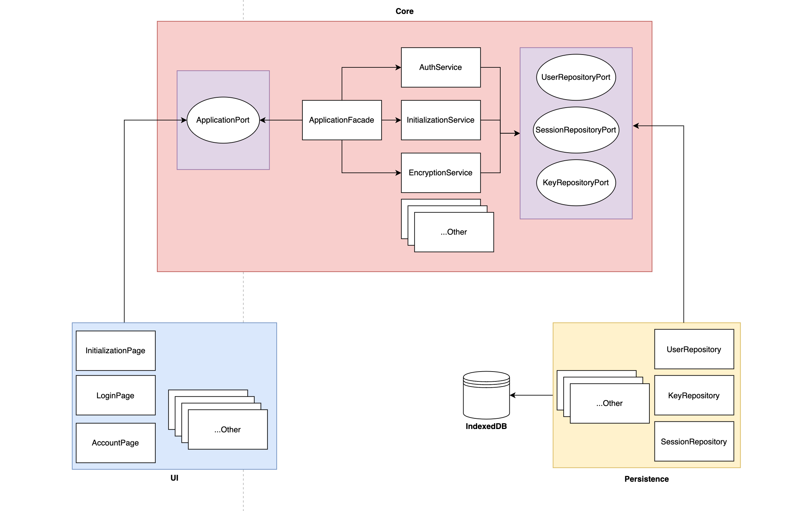

# WH extension

[Video link](https://youtu.be/9QgEBtCzLBk) of the app in action.

> The extension works properly only in the Google Chrome Dev
> because [showPopup](https://developer.chrome.com/docs/extensions/reference/action/#method-openPopup) method is marked as "Dev channel".

## Architecture

[Hexagonal/ports&adapters](https://en.wikipedia.org/wiki/Hexagonal_architecture_(software)) architecture was taken as the basis,
where the highest-level component (core) contains the most important application logic.
The rest are adapters for the core (ui and persistence). UI component contains all React code and is responsible
for ui rendering. It interacts with the core through the ApplicationPort interface.
Persistence implements repositories based on appropriate ports and indexedDB communication logic.

